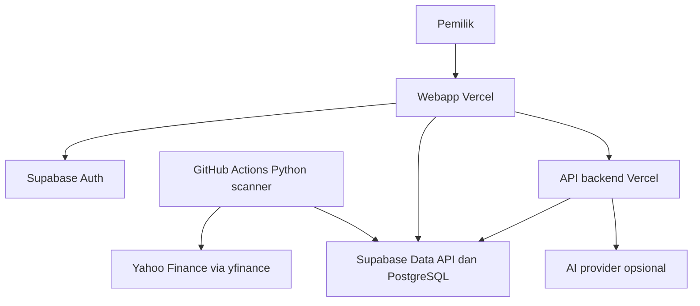

# Dokumentasi Teknis — IDX Night Scanner

Versi: 0.2.0 • 2026-09-28 • Status: rancangan, belum di-deploy

Aturan finansial ada di [SOT.md](SOT.md). Dokumen ini menentukan cara membangun dan mengoperasikan sistem. Jangan mengulang rumus berbeda dalam frontend.

Kontrak backend M4 pada migration 005 yang sudah diterapkan di development mode
fixture dan telah diterapkan ke production lewat CLI2026-10-02; smoke mutasi
production belum lulus. Kontrak termasuk
RPC, lifecycle open/provisional, koreksi, decimal policy, CSV dan gate development:
[docs/ACTUAL_JOURNAL.md](docs/ACTUAL_JOURNAL.md). Tabel/API di bawah tetap rancangan
untuk scope yang belum diimplementasikan; bukan bukti deployment.

## 1. Arsitektur



GitHub runner hanya hidup selama job. Supabase melayani data/API persisten. Vercel menyediakan frontend serta endpoint ringan yang membutuhkan validasi/secret. Tidak perlu VPS, cPanel, proses Python 24 jam, atau Supabase Edge Functions untuk yfinance.

Proses scan tidak bergantung browser, AI, atau request frontend yang panjang. Statistik sumber tunggal dihitung dengan modul deterministik dan SQL views/RPC teruji; frontend memformat hasil saja.

## 2. Struktur repository yang ditargetkan

```text
README.md
AGENTS.md
PRD.md
SOT.md
TECHNICAL_DOC.md
CODEX_HANDOFF.md
apps/web/                 # Next.js, TypeScript; Vercel Root Directory
scanner/                 # Python package
  src/idx_scanner/
    providers/           # Yahoo adapter, fixture adapter
    indicators/
    strategies/
    exits/               # fixed_rr dan ma_close; terpisah dari entry rules
    simulation/
    persistence/
    cli.py
  tests/
  pyproject.toml
  uv.lock
supabase/
  migrations/
  tests/                 # RLS + RPC integration checks
contracts/               # JSON Schema/OpenAPI contracts
fixtures/                # small deterministic synthetic OHLCV only
config/                  # example configs, no credentials
.github/workflows/       # test, scheduled scan, controlled maintenance
.env.example             # placeholders and intended scope only
```

Pilih versi stable yang kompatibel saat implementasi, pin lockfiles dan runtime. Jangan mengklaim versi tertentu “latest” tanpa verifikasi. Dev scripts dan perintah aktual ditambahkan setelah scaffold tersedia.

## 3. Data access dan keamanan

- Supabase Auth: default owner account dibuat melalui dashboard/invite terkontrol; public signup disabled. Gunakan email/password untuk MVP agar scanner tidak bergantung layanan email custom. Reset password dikonfigurasi sebelum produksi.
- `app_members` menyimpan owner UUID yang diizinkan; bukan sekadar seluruh akun authenticated.
- Aktifkan RLS pada seluruh tabel yang terpapar Data API. Tanpa JWT owner, tidak ada akses data aplikasi.
- Data market/scan: owner boleh read, browser tidak boleh insert/update/delete. Scanner backend privileged menulis melalui jalur terkontrol.
- Actual journal: owner melakukan mutasi ledger melalui RPC transaksi dengan JWT pengguna. Revoke direct table DML pada ledger dari anon/authenticated agar validasi saldo tidak bisa dilewati. Untuk RPC SECURITY DEFINER, restrict search_path, explicit auth.uid + app_members + ownership checks, dan execute grants hanya untuk authenticated; RLS read tetap wajib. SECURITY INVOKER dapat dipakai untuk fungsi read atau mutasi yang tidak memerlukan privilege tambahan.
- Multi-row write (fills, posisi, audit) dilakukan satu transaksi database, bukan beberapa REST call independen.
- Publishable/anon key boleh berada di frontend bersama RLS yang benar. Service-role/secret key, database password, dan AI key tidak boleh berprefix NEXT_PUBLIC atau masuk bundle.
- `SUPABASE_SERVICE_ROLE_KEY` hanya GitHub Secrets untuk scanner/maintenance; tidak diperlukan di frontend. Gunakan dedicated least-privilege DB role jika adapter koneksi SQL dipilih kemudian.
- Backend Vercel memverifikasi identitas pengguna sebelum setiap endpoint, menggunakan user JWT untuk DB agar RLS tetap berlaku. Jangan mengandalkan UI hidden sebagai authorization.
- Validasi IDOR, SQL injection, malformed CSV, file size, numeric bounds, dan oversell. Cookie/session serta origin/CSRF handling mengikuti framework yang dipakai dan diuji untuk mutasi.
- Log tidak boleh mencetak token, connection string, full provider payload sensitif, atau private journal ke public artifacts.

## 4. Model data minimal

Nama berikut adalah kontrak rancangan. Migrasi SQL harus mendefinisikan tipe, FK, unique/check constraints, RLS, dan indeks sesuai query aktual. Gunakan UUID untuk ID, date untuk sesi, timestamptz UTC untuk event, numeric untuk uang/harga, bigint/numeric tervalidasi untuk quantity, JSONB hanya untuk config/snapshot terstruktur.

| Tabel | Kolom/fungsi utama |
| --- | --- |
| app_members | user_id PK, role=owner, enabled |
| instruments | ticker PK, yahoo_symbol unique, currency, exchange, mapping_verified_at |
| universe_versions | id, index_name, source_url, published_date, checksum, imported_at |
| universe_memberships | version_id, ticker, effective_from, effective_to exclusive |
| exchange_sessions | date PK, is_open, open_at, close_at, source_url, calendar_version |
| provider_fetches | id, provider, package_version, fetched_at, requested_range, content_hash, status |
| daily_bars | ticker, session_date, revision, OHLCV, adj_close, fetch_id, quality, corporate_action_state |
| corporate_actions | ticker, event_date, type, provider payload, reconciled status, audit reference |
| strategy_versions | id/version, entry config JSON (tanpa exit), config_hash, indicator_definition, source_commit |
| exit_policy_versions | id/version, mode, parameters JSON, config_hash, created_at |
| experiments | id, entry_strategy_version, exit_policy_version, cost_model, activated_at, cohort_policy, immutable config |
| rs_rank_snapshots | session, universe/input digest, N, eligible/excluded counts, ranked returns/tickers, coverage status |
| scan_runs | id, target_session, run_type, attempt, commit/config/universe IDs, counts, heartbeat, status |
| scan_run_items | run_id, ticker, status, reason, source_bar_date, input_digest, error_code |
| fractal_levels | ticker, side, pivot_date, available_session, price, calculation/data version |
| signals | id, strategy/config/universe, ticker, session_date, published_at, upper_fractal_id, trigger/eligibility flags |
| signal_snapshots | signal_id, input revision refs/digest, indicator values, level values/dates, rule outcomes |
| paper_trades | signal_id, experiment_id, state, planned_entry_session, entry, SL, TP nullable, risk, exit_policy_snapshot, pending_exit_session/signal_at, cost model, exit_reason |
| paper_events | trade_id, event_date, event_type, price, fee, ambiguity payload, revision metadata |
| actual_trades | owner_id, primary_strategy_id, signal_id nullable, status, initial_stop, initial_risk, exit_policy_snapshot, override_reason, entry_finalized_at |
| actual_fills | trade_id, side, timestamp/session, quantity, price, fee_idr, fee_status, idempotency_key, correction_ref |
| trade_tags | trade_id, strategy/setup tag; unique pair |
| stop_events | actual_trade_id, old/new stop, reason, timestamp; initial stop tetap tersimpan |
| account_cash_events | owner_id, deposit/withdrawal/dividend type, amount, date, reference |
| journal_notes | owner_id, trade_id, text, created/updated_at |
| ai_comments | input_digest, model/provider/prompt_version, validated JSON, status, cost usage |
| audit_events | actor, entity, action, prior/new hashes, reason, timestamp |
| job_locks | lock_key PK, owner_run_id, lease_until, heartbeat_at |

Revisions bar immutable. Buat view current_daily_bars yang memilih revisi terbaru valid. Signal snapshot merujuk revisi yang dipakai; tidak otomatis mengikuti view terbaru ketika direproduksi.

Pilih provider payload retention terbatas; jangan menduplikasi histori 3 tahun penuh untuk setiap signal. Simpan revision references/digest dan compact features. Pertahankan revision yang dibutuhkan audit; archive/retention tidak boleh merusak reproducibility.

### Constraints wajib

- SOT signal unique key + guard satu fractal emitted signal; experiment namespace terpisah.
- Satu paper trade per signal/experiment; satu active position per ticker/strategy/config/experiment pada baseline.
- Actual fills quantity > 0, price > 0, fee >= 0; sum sells <= sum buys melalui transactional validation.
- Initial stop positif; initial risk > 0 sebelum trade dapat difinalisasi sebagai entry lengkap.
- Universe member period tidak ambigu untuk ticker/sesi yang sama; source metadata wajib pada live import.
- Gap kalender atau null level tidak diubah menjadi angka 0.
- Index minimal: bars(ticker,date), signals(date,strategy), actual_trades(owner,status), run_items(run,status).

## 5. Kontrak API

Gunakan Supabase Data API untuk read yang dilindungi RLS. BFF Vercel disediakan untuk mutasi tervalidasi, AI, dan export. Jangan menambahkan dua sumber logika rule yang berbeda.

Semua endpoint BFF di bawah wajib owner-auth; pagination cursor dan limit maksimal 200. Error format:

```json
{"error":{"code":"DATA_STALE","message":"Data sesi target belum lengkap","request_id":"..."}}
```

| Method/path | Input utama | Hasil/aturan |
| --- | --- | --- |
| GET /api/overview | session optional | coverage, last successful run, count signal/open trades |
| GET /api/signals | session,strategy,cursor | list + data freshness + version metadata |
| GET /api/signals/:id | id | snapshot, rules, plan, provenance |
| GET /api/chart/:ticker | from,to | current bars dan indicator series; level available-at |
| GET /api/journal | mode,status,cursor | paper/actual dipisah eksplisit |
| POST /api/trades | primary_strategy,signal optional,initial_stop | actual draft, bukan actual fill |
| POST /api/trades/:id/fills | side,time,qty,price,fee,status,idempotency_key | atomic fill+position+audit RPC |
| POST /api/trades/:id/finalize-entry | revision | freeze entry batch dan initial risk |
| POST /api/trades/:id/stops | stop,reason,expected_revision | append stop event; initial risk tidak berubah |
| POST /api/trades/:id/corrections | target_event,changes,reason,expected_revision | append correction, recompute audited |
| POST /api/trades/:id/notes | text | note tervalidasi milik owner |
| GET /api/analytics | mode,strategy,version,exit_policy,experiment,from,to,cost_model | metrics, cohort definition, sample size, ambiguity counts |
| POST /api/experiments | entry_version,exit_mode,parameters,cost_model,start_session,idempotency_key | immutable experiment; start setelah aktivasi, validasi RR positif/finite atau MA5/10/20 |
| GET /api/operations/runs | cursor | run log/status tanpa secret |
| GET /api/export/journal | mode,from,to | CSV aman dari formula injection |
| POST /api/ai/commentary | signal_id | optional; disabled=503 FEATURE_DISABLED |

MVP manual rerun dilakukan melalui link halaman GitHub Actions `Run workflow` oleh pemilik repo. Tidak menyimpan PAT GitHub hanya untuk tombol aplikasi. Native in-app dispatch menjadi tambahan setelah GitHub App/credential scoped tersedia; jangan membuat endpoint publik yang dapat men-trigger job.

Read chart baseline dapat memakai precomputed indicator rows atau server deterministic cache. Untuk production, frontend dilarang menghitung ulang sinyal berdasarkan library dengan seeding berbeda.

### Contoh signal response (schema example, bukan saham live)

```json
{
  "id":"example-only",
  "ticker":"TEST",
  "session_date":"2026-01-05",
  "strategy":"FRACTAL_BREAKOUT_V1",
  "config_hash":"example",
  "data_mode":"fixture",
  "reference_close":112,
  "trigger_level":110,
  "initial_stop_candidate":100,
  "entry_mode":"next_session_open",
  "actual_entry":null,
  "execution_eligible":true,
  "data_quality":"valid",
  "rules":{"previous_close_at_or_below_level":true,"close_above_level":true},
  "disclaimer_code":"REFERENCE_PRICE_NOT_FILL"
}
```

## 6. Scanner pipeline

1. Tentukan target_session menurut Asia/Jakarta dan calendar resmi. Scheduled holiday → skipped_calendar. Manual historical → backfill/backtest namespace.
2. Acquire lease lock `scan:<target_session>:<config_hash>` atomically. Lease default 15 menit, heartbeat 60 detik; configurable. GitHub concurrency tambahan tidak menggantikan DB idempotency.
3. Resume failed/pending run items; jangan menghitung ulang yang valid tanpa alasan/version.
4. Load universe efektif + ticker open positions yang keluar indeks untuk maintenance posisi saja.
5. Fetch initial/incremental data. Default kelompok 10 ticker, concurrency rendah maksimal 3, bounded retries 3 dengan backoff+jitter. Hormati rate limit; jangan memakai proxy rotation untuk menghindari pembatasan.
6. Validasi dan simpan revision bar/action/provenance. Catat fetched, stale, missing, held, insufficient secara terpisah.
7. Proses event paper yang jatuh pada target_session dari plan sesi sebelumnya; jangan membuka trade dari signal sesi target pada sesi yang sama.
8. Hitung indikator dan strategi untuk data valid. RS membutuhkan barrier cross-section setelah fetch seluruh universe, bukan ranking dalam batch10 ticker. Simpan rank snapshot; incomplete → hold RS saja. Simpan signal sekali lalu fan-out ke experiment aktif sebelum sesi entry dimulai; eligibility posisi diperiksa per experiment.
9. Publikasikan per ticker secara transaksional. Run total dapat partial; UI menunjukkan actual numerator/denominator.
10. Refresh metrics dari event ledger dan cohort, lalu simpan run completion/heartbeat.
11. AI enrichment optional setelah publikasi. AI failure tidak membatalkan commit scan.

Ketika replay beberapa sesi, proses kronologis. Jangan memakai future upper/lower pivots. Ticker failure tidak menggagalkan hasil ticker lain, tetapi overall run partial harus terlihat.

### Kontrak engine entry/exit

`EntryStrategy.evaluate(history, universe_context) -> SignalCandidate` tidak membaca exit config. `ExitPolicy.evaluate(position_snapshot, completed_bar, pending_exit) -> Events` tidak mengubah entry signal. Paper evaluator wajib mengikuti urutan open → standing SL/TP → close-based MA signal, bukan urutan pemanggilan indikator.

Fixed RR config: `{mode:"fixed_rr", target_r:2}`. MA config: `{mode:"ma_close", ma_type:"SMA", period:10}`; target_r/TP null. Simpan exit_policy_version dan immutable config_hash; tolak parameter yang bertentangan, NaN/Inf, period di luar pilihan. MA period5/10/20 hanya diterapkan pada completed close; recurring processing idempotent untuk pending exit dan satu fill. Initial SL tidak pernah otomatis mengikuti MA turun.

Signal identity tidak memasukkan exit policy. Experiment activation harus sebelum entry session; paper pending plan menyimpan config sendiri. Read API/UI menampilkan reference TP dari close hanya untuk fixed_rr dengan label indikatif; TP final dari entry fill, ma_close “open target”. Actual strategy-exit alert tidak membuat actual sell fill.

## 7. GitHub Actions

Contoh jadwal yang perlu dibuat ketika implementasi:

```yaml
on:
  schedule:
    - cron: '17 13 * * 1-5' # target 20.17 WIB, UTC; calendar guard tetap wajib
    - cron: '17 15 * * 1-5' # recovery 22.17 WIB, no-op bila sudah lengkap
  workflow_dispatch:
    inputs:
      target_session:
        description: 'Opsional YYYY-MM-DD; sesi lama ditandai backfill'
        required: false
permissions:
  contents: read
concurrency:
  group: nightly-scan
  cancel-in-progress: false
```

Ini fragmen spesifikasi, belum workflow runnable. Scheduled jobs hanya menjalankan main/default branch trusted. Gunakan runner Linux standar, timeout job 20 menit awal, dependency cache, pin actions ke commit SHA terverifikasi saat implementasi. Secret-bearing workflow tidak boleh berjalan pada untrusted fork PR.

Recovery memeriksa kebutuhan fetch sebelum bekerja; biaya job tetap dipantau. Dua cron bukan jaminan SLA. Schedule dapat terlambat/terlewat; tampilkan stale run dan sediakan workflow_dispatch. Tidak membuat sinyal backdated setelah sesi entry dimulai.

Pengaturan akun: Actions spending cap/paid overage nonaktif jika target biaya nol. Jatah account shared; initial bootstrap/full refresh dapat dijalankan manual terpisah dari nightly agar tidak timeout.

## 8. Environment contract

| Nama | Lokasi | Catatan |
| --- | --- | --- |
| NEXT_PUBLIC_SUPABASE_URL | Vercel + local web | URL proyek; bukan secret |
| NEXT_PUBLIC_SUPABASE_PUBLISHABLE_KEY | Vercel + local web | Public key, RLS wajib; legacy anon jika sesuai SDK |
| SUPABASE_URL | GitHub Secrets/config scanner | URL proyek |
| SUPABASE_SECRET_KEY | GitHub protected environment secret | Nama aktual adapter scanner; privileged, jangan kirim Vercel/browser/log |
| APP_OWNER_USER_ID | Protected config server/DB | UUID akun owner, bukan alamat email dalam repo |
| ALLOW_FIXTURE_PREVIEW | Vercel Preview/local saja | Production false/unset; preview fixture harus eksplisit |
| DATA_MODE | Per environment | fixture atau live; production harus live |
| AI_ENABLED | Vercel | false default |
| AI_PROVIDER / AI_MODEL | Vercel | Pilihan model terverifikasi, tidak hardcode model tebakan |
| AI_API_KEY | Vercel secret | Tidak perlu untuk baseline |
| AI_BASE_URL | Vercel server config | HTTPS allowlist; tidak dapat diubah melalui request user |

Fee/risk/universe/strategy config disimpan berversi di DB/config release, bukan secret env tersembunyi. Jangan menambahkan API key Yahoo palsu; yfinance tidak menjadi layanan berlisensi hanya karena ada key AI.

Implementasi saat ini memakai `SUPABASE_SECRET_KEY`, bukan nama rancangan lama
`SUPABASE_SERVICE_ROLE_KEY`. `APP_BASE_URL` belum digunakan frontend; callback
berasal dari origin browser dan wajib diizinkan di Supabase Auth. Provider dipilih
eksplisit lewat CLI `--provider`; env saja tidak mengganti provider atau mode DB.
Baseline tidak memerlukan AI secrets. Daftar env production/preview serta hasil
preflight aktual: [PRODUCTION_READINESS](docs/PRODUCTION_READINESS.md).

## 9. AI contract (P1)

Input hanya snapshot fitur, level, status, dan statistik terpilih yang perlu. Tidak mengirim seluruh private journal secara default. Provider adapter memisahkan transport, model, timeout, schema, dan error mapping.

Output schema: summary, rule_explanations[], risks[], evidence_ids[], limitations[]. Validasi JSON Schema, evidence reference, dan kesesuaian angka dengan input. Structured output bukan jaminan kebenaran isi. Tolak fabricated price, news, probability, atau win rate. Simpan model/prompt/input hash. Timeout/retry/cost budget kecil; response cache menurut digest. Invalid output → tampilkan deterministic template summary.

## 10. Observability, backup, dan free tier

- Dashboard operations: last run, target session, latency, coverage, failures, provider package version, config hash.
- Monitor DB size; alert internal usulan pada 70% dan 85% kuota aktual yang diverifikasi. Retention logs default 30 hari; metadata audit inti tetap disimpan.
- Hindari raw response/PNG chart harian yang memboroskan storage. Chart dirender on demand.
- Backup encrypted/manual export sebelum perubahan schema besar dan secara berkala. Simpan di lokasi privat terpisah, bukan public Actions artifacts. Uji restore pada dev project.
- Free tier tidak diasumsikan memiliki backup/SLA berbayar. Jangan mengklaim backup selesai sebelum diuji.
- Supabase pause pada low activity, rate limit Yahoo, GitHub cron delay, dan kuota penuh harus menghasilkan status jelas; jangan menyembunyikan sebagai empty scanner.
- Tingkatkan layanan hanya setelah penggunaan diukur dan pengguna memutuskan; jangan mengaktifkan billing berbayar otomatis.

## 11. Deployment order

1. Implementasi dan test lokal dengan fixture; lint/typecheck/unit/RLS checks.
2. Buat/pilih repo privat baru dan Supabase dev project sesuai akses yang diberikan. Jangan menyentuh proyek lain.
3. Migrasi non-destruktif, seed config/owner terkontrol; fixture dilarang pada production.
4. Verifikasi universe/calendar dan koneksi provider pada runner dengan 5–10 ticker nyata.
5. Sambungkan Vercel ke repository frontend yang terpisah, root repository; set env, auth redirect, preview terisolasi. `apps/web` adalah rancangan monorepo lama, bukan struktur implementasi saat ini.
6. Jalankan manual scanner dan smoke test owner/non-owner, chart, fill, metrics.
7. Aktifkan primary/recovery cron, monitor beberapa sesi, perluas ke seluruh universe setelah gate lulus.
8. Catat deployed commit, migration version, live source dates, dan hasil smoke test.

Paket dokumen ini tidak memberikan akses akun atau menyatakan layanan sudah dibuat. Deployment/mutasi remote mengikuti otorisasi pengguna dalam sesi pengembangan dan kontrol akses yang berlaku. Jangan meminta konfirmasi berulang untuk tindakan yang sudah diotorisasi.

## 12. Referensi resmi dan status verifikasi

Dicek dalam perencanaan pada 2026-09-28; periksa ulang saat provisioning karena paket layanan bisa berubah.

| Referensi | Informasi yang dipakai |
| --- | --- |
| https://supabase.com/pricing | Free: DB500MB, file1GB, egress5GB, dua proyek aktif, pause inactivity |
| https://supabase.com/docs/guides/api | REST Data API dari database |
| https://supabase.com/docs/guides/functions | Edge Functions TypeScript/Deno |
| https://supabase.com/docs/guides/platform/free-project-pausing | Pause free project pada aktivitas rendah |
| https://docs.github.com/en/billing/reference/product-usage-included | GitHub Free Actions2.000 menit/bulan pada ketentuan runner/repo terkait |
| https://docs.github.com/en/actions/how-tos/troubleshoot-workflows | Scheduled jobs dapat delayed/dropped |
| https://vercel.com/docs/plans/hobby | Personal/non-commercial Hobby scope |
| https://github.com/ranaroussi/yfinance | Independen dari Yahoo; research/personal-use caveat |
| https://ranaroussi.github.io/yfinance/reference/api/yfinance.download.html | Parameter download/interval/adjustment |
| https://www.idx.co.id/id/produk/indeks/ | Referensi indeks; ambil pengumuman konstituen efektif untuk live |
| https://www.tradingview.com/pine-script-docs/visuals/plots/ | Offset plot ke masa lalu/masa depan |
| https://www.tradingview.com/pine-script-docs/concepts/other-timeframes-and-data/ | Security/timeframe/lookahead |
| https://www.tradingview.com/pine-script-docs/concepts/strategies/ | Broker emulator next-tick/next-bar timing dan batas asumsi OHLC |
| https://scholarworks.wmich.edu/math_pubs/40/ | Risiko backtest overfitting; bukan bukti edge setup ini |
| https://ai.google.dev/gemini-api/docs/structured-output | Structured output Gemini |

Cuplikan trading dari pengguna diringkas di SOT. Tidak ada quota/timeframe exact-close BEI, list ticker, fee broker, atau provider uptime yang diasumsikan dari ingatan.
